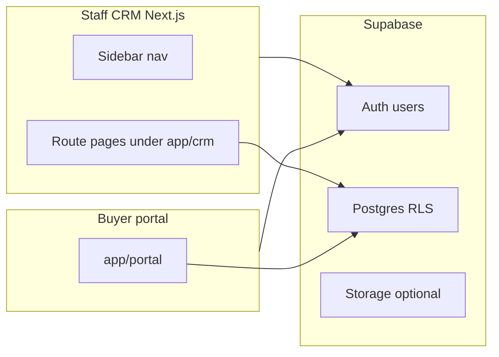

# BuildCon vs PRD: gap analysis and phased roadmap

## Context

[README.md](README.md) describes the **MVP staff CRM** (Next.js App Router + Supabase): project-scoped `/crm`, inventory, inquiries, customers, bookings with payment schedules, financials, brokers, documents, and more. **Phases A–F of this roadmap are implemented** (see completed todos in frontmatter and “Completed roadmap” below): sales pipeline, canonical unit statuses, dashboard aggregates, pricing profile + quotations, demand vs receipt outstanding views, CLD stage master + completions + notification queue, buyer portal (`/portal`) with linked-customer RLS, and possession cases (snag/checklist JSON + workflow stages).

**Still largely out of scope** unless called out under [Phase G — backlog](#phase-g--prd-depth--integrations-backlog): WhatsApp / Meta / website inbound automation, Tally (or other ERP) sync, payment gateways, auto demand letters, delay interest engines, e-sign, and full Mumbai legal pack depth.

Your PRD spans **sales → inventory → pricing → booking → legal/agreements → collections → CLD → channel partners → customer portal → possession**. This document records **what shipped in A–F**, **what remains deferred or partial**, and **what to build next**.

## Architecture snapshot (today)

Authorization is **project-scoped** for staff via `project_members` and `has_project_access` (see [supabase/schema.sql](supabase/schema.sql)). The buyer portal uses **auth users** plus `profiles.linked_customer_id` (and related policies) so linked customers can read their own bookings, schedules, quotations, and possession rows without staff roles.

## Module coverage (PRD vs repo — delivered vs deferred)

Navigation is defined in [app/crm/_components/nav.ts](app/crm/_components/nav.ts): Dashboard, Project, Inventory, Inquiry, Bookings, Customers, Brokers, Financials, **Quotations**, Documents, **CLD**, **Possession**, Users & Access. Buyer-facing UI lives under [app/portal/](app/portal/).

For each PRD module: **Delivered (A–F)** summarizes what is in the codebase; **Deferred / partial** is what the full PRD still expects beyond that slice.

**1. Lead & Enquiry Management**

- **Delivered:** Enquiry capture as before ([app/crm/inquiry/page.tsx](app/crm/inquiry/page.tsx), `sales_inquiries`). **Pipeline:** `sales_opportunities` with funnel stages, `assigned_to`, linked 1:1 to an inquiry; `sales_follow_ups`, `sales_site_visits` ([supabase/migrations/20260515120000_sales_opportunities_pipeline.sql](supabase/migrations/20260515120000_sales_opportunities_pipeline.sql)); UI includes pipeline dialog ([app/crm/inquiry/inquiry-pipeline-dialog.tsx](app/crm/inquiry/inquiry-pipeline-dialog.tsx)). **Dashboard** aggregates opportunity counts by stage ([app/crm/dashboard/page.tsx](app/crm/dashboard/page.tsx)).
- **Deferred / partial:** Auto-assignment rules; structured call log separate from notes; inbound leads from Website / Meta / portals / WhatsApp; deeper funnel analytics (conversion rates, cohorts).

**2. Project & Inventory Management**

- **Delivered:** Same project + unit grid and create flows as before. **Canonical unit lifecycle** in [app/crm/inventory/unit-status.ts](app/crm/inventory/unit-status.ts) (re-exported from [app/crm/inventory/inventory-utils.ts](app/crm/inventory/inventory-utils.ts)) with migration from legacy letter codes ([supabase/migrations/20260515121000_unit_status_canonical.sql](supabase/migrations/20260515121000_unit_status_canonical.sql)); filters and booking guards use these helpers.
- **Deferred / partial:** Separate carpet / BUA / RERA areas; floor-rise matrix; PLC line items; terrace / deck / loading as structured fields; pricing beyond per-unit `rate` + quotations; bulk import as a first-class product path; optimistic locking / reservation UX beyond normal DB updates.

**3. Pricing & Cost Sheet Engine**

- **Delivered:** [app/crm/booking-cost-utils.ts](app/crm/booking-cost-utils.ts) extended for project-level GST / stamp / registration inputs. **Pricing profile** columns on `projects` and **`quotations`** table with status lifecycle ([supabase/migrations/20260515122000_pricing_quotations.sql](supabase/migrations/20260515122000_pricing_quotations.sql)); staff UI [app/crm/quotations/page.tsx](app/crm/quotations/page.tsx).
- **Deferred / partial:** CLP / flexi **plan templates** as reusable products; formal PDF quotation pack; discount **approval** workflow; rule versions per jurisdiction beyond editable percentages/fees.

**4. Booking Management**

- **Delivered:** Existing booking + co-buyer flows ([app/crm/bookings/page.tsx](app/crm/bookings/page.tsx), [app/api/crm/bookings/route.ts](app/api/crm/bookings/route.ts)); unit transitions aligned with canonical statuses.
- **Deferred / partial:** Explicit sub-states (Token → Application → Allotment → Confirmation) as a governed state machine in UI/DB; governed **cancellation + refund** policy; KYC vault on Storage with strict lifecycle (portal migration adds read paths for linked customers where applicable — not a full document product).

**5. Agreement & Documentation**

- **Delivered:** [app/crm/documents/page.tsx](app/crm/documents/page.tsx) (templates + records) unchanged in scope from MVP.
- **Deferred / partial:** Mumbai-specific stamp/registration **tracking** as operational truth (estimates exist on quotations); annexures, demand letters, NOCs, RERA pack automation; template versioning; e-sign.

**6. Collections & Accounts**

- **Delivered:** [app/crm/financials/page.tsx](app/crm/financials/page.tsx) for schedules + collections. **Ledger view:** [supabase/migrations/20260515123000_financial_ledger_view.sql](supabase/migrations/20260515123000_financial_ledger_view.sql) defines `v_payment_schedule_outstanding` (demand vs received, outstanding, `is_overdue`); dashboard and financials can consume it.
- **Deferred / partial:** Interest / TDS / GST on receipts; auto demand notices; broker payouts; Tally / ERP / bank / gateway reconciliation; ad-hoc demand lines as first-class rows (view is schedule-centric today).

**7. Construction Linked Demand (CLD)**

- **Delivered:** `project_cld_stages`, `cld_stage_completions`, notification queue table + staff UI [app/crm/cld/page.tsx](app/crm/cld/page.tsx) ([supabase/migrations/20260515124000_cld_and_notifications.sql](supabase/migrations/20260515124000_cld_and_notifications.sql)).
- **Deferred / partial:** Auto-posting of CLD amounts into `payment_schedules` or separate demand documents; delay interest; production-grade job runner (cron/edge worker) if not already wired in ops; customer-facing CLD letters.

**8. Channel Partner Management**

- **Delivered:** Broker master + inquiry link as before. **`profiles.linked_broker_id`** for future portal identity ([supabase/migrations/20260515125000_portal_possession.sql](supabase/migrations/20260515125000_portal_possession.sql)); admin can set links ([app/crm/users/page.tsx](app/crm/users/page.tsx) mentions buyer / CP portal).
- **Deferred / partial:** Commission slabs, deal approvals, payout statements; **dedicated CP portal routes** and broker-specific read UIs (schema hook exists; product surface is thin).

**9. Customer Portal**

- **Delivered:** [app/portal/layout.tsx](app/portal/layout.tsx), [app/portal/page.tsx](app/portal/page.tsx), booking detail [app/portal/bookings/[id]/page.tsx](app/portal/bookings/[id]/page.tsx); linked customer sees own bookings. **RLS:** policies for bookings / schedules / collections / quotations for linked profiles ([supabase/migrations/20260515125000_portal_possession.sql](supabase/migrations/20260515125000_portal_possession.sql), [supabase/migrations/20260515127000_quotations_customer_portal_read.sql](supabase/migrations/20260515127000_quotations_customer_portal_read.sql)).
- **Deferred / partial:** Full self-serve document library, payment download center, notifications, mobile polish, magic-link-only auth if you want zero password for buyers.

**10. Possession & Handover**

- **Delivered:** `possession_cases` with `snag_list` / `checklist` jsonb, workflow stages, keys handover timestamp; staff UI [app/crm/possession/page.tsx](app/crm/possession/page.tsx); customer read policy when linked to booking’s customer ([supabase/migrations/20260515125000_portal_possession.sql](supabase/migrations/20260515125000_portal_possession.sql)).
- **Deferred / partial:** Fit-out NOCs, meter applications, society formation, maintenance deposit modules as separate entities; rich snag photos on Storage; hard link to unit status “Possession given” automation (cases exist alongside unit status).

---

## Completed roadmap (Phases A–F) — as built

These phases are **done** (see YAML todos). Summaries:

- **Phase A — Pipeline, inventory language, dashboard:** `sales_opportunities` + follow-ups + site visits; canonical unit statuses + migration; dashboard funnel + inventory mix + 30-day collections + overdue line count ([app/crm/dashboard/page.tsx](app/crm/dashboard/page.tsx)).
- **Phase B — Pricing:** `projects.pricing_*` + `quotations` + [app/crm/quotations/page.tsx](app/crm/quotations/page.tsx) + cost sheet hooks in [app/crm/booking-cost-utils.ts](app/crm/booking-cost-utils.ts). Booking hardening (explicit workflow + cancellation + KYC vault) remains mostly Phase G.
- **Phase C — Ledger:** `v_payment_schedule_outstanding` for demand vs receipts and overdue; Tally/export still future.
- **Phase D — CLD:** Stage master, completions log, notification queue + CRM CLD page.
- **Phase E — Portals:** Buyer `/portal` + profile linking + RLS for own data; broker link column — **CP product UI** still thin.
- **Phase F — Possession:** `possession_cases` + CRM possession page + portal read where linked.

---

## Phase G — PRD depth & integrations (backlog)

Pick items here based on business priority (not re-litigating A–F):

- **Integrations:** WhatsApp / Meta / website lead capture; Tally or CSV export automation; bank / gateway reconciliation.
- **Collections:** Interest/TDS/GST; auto demand PDFs/email; ad-hoc demands as rows.
- **Booking:** Named workflow states; cancellation/refund policy engine; KYC upload product on Storage + staff review.
- **Legal/docs:** Template versioning; e-sign; jurisdiction-specific disclosure packs.
- **Inventory:** Area matrix, PLC lines, bulk import UX.
- **CP portal:** Routes and pages for `linked_broker_id`, commission statements, approvals.
- **Buyer portal:** Full documents/demands/receipts hub, notifications.

---

## Key engineering constraints (from the codebase)

- **RLS and project scope** are central: any new tables need `project_id` + policies mirroring [supabase/schema.sql](supabase/schema.sql) patterns (portal tables additionally use `profiles` links).
- **Large page files** (e.g. customers/bookings/inquiry) suggest future refactors as features grow; prefer **new hooks + smaller components** when adding major flows to avoid unmaintainable single files.
- **Nav** remains the product map: staff areas in [nav.ts](app/crm/_components/nav.ts); buyer isolation under [app/portal/](app/portal/).

---

## Suggested immediate next step

**Phase A–F are complete.** Choose the first **Phase G** slice that unlocks revenue or reduces ops load (for example: **Tally/CSV export** from `v_payment_schedule_outstanding` + collections, or **CP portal** pages on top of `linked_broker_id`, or **buyer portal** expansion to full schedule/receipt PDFs). Re-run a short discovery on [app/crm/documents/page.tsx](app/crm/documents/page.tsx) before promising legal automation depth.
